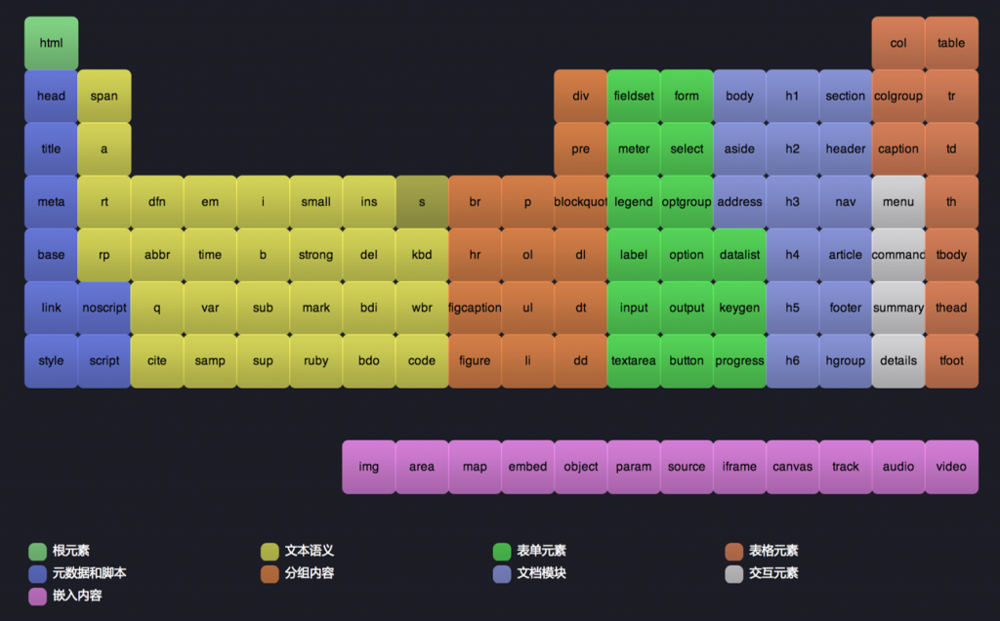
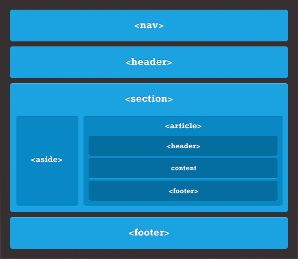

# 什么是语义化

HTML 语义化就是**根据具体内容，选择合适的 HTML 标签进行代码的编写。用合理 HTML 标记以及其特有的属性去格式化文档内容**。便于开发者阅读和写出更优雅的代码，同时让搜索引擎的爬虫能更好的识别。

**元素 + 属性 + 属性值(+ 文档结构) = 语义化**

# 为什么要语义化

* 清晰页面结构, 增强页面可读性, 即使样式丢失的时候也能让页面呈现清晰的结构
* 支持更多的设备, 屏幕阅读器会根据标记来**读**网页
* 有利于 SEO;
* 便于团队开发和维护

# 各种常用标签的使用场景



[HTML 语义化的应用](https://www.biaodianfu.com/html-semantic.html)

[Semantic HTML](http://justineo.github.io/slideshows/semantic-html/#/1)

* blockquote、q 和 cite 的区别
  > `blockquote`：引用长文本，包含换行。
  > `q`：引用短文本，不包含换行。
  > `cite`：注明引用出处

- figure 和 figcaption 标签的作用

  > 文章中的附加图片，添加图片及图片名称描述文章中的代码示例，添加代码示例和代码示例的名称

- main

  > 这部分内容在文档中应当是独一无二的，不包含任何在一系列文档中重复的内容，比如侧边栏，导航栏链接，版权信息，网站 logo，搜索框等。

- pre 与 code 标签之间的区别和联系

- `<b>`、`<strong>`、`<i>`、`<em>`的区别

- `<s>`与`<del>`、`<u>`与`<ins>`的区别

  * $100 <s>$120</s> //`<s>`表示不再相关或准确;
  * <del>此段内容被删除</del>
  * <ins>插入的内容</ins>

- `<mark>` 标签代表突出<mark>高亮</mark>的文字。例如可以用来显示搜索引擎搜索后关键词。

- `<dfn>`术语: <dfn title="互联网">互联网</dfn>

# 页面结构



```html
<header>
  <div id="logo">HTML</div>
  <nav>
    <ul>
      <li>
        <a href="/">Home</a>
      </li>
      <li>
        <a href="/link">Page</a>
      </li>
    </ul>
  </nav>
</header>

<main id="main">
  <article>
    <h2>Title 1</h2>
    <p>Content 1</p>
  </article>
  <article>
    <header>
      <hgroup>
        <h1>标题</h1>
        <h2>副标题</h2>
        <div>Post April 2, 2018 by <a>Addamx</a></div>
      </hgroup>
    </header>
    <p>Content 2</p>
  </article>

  <section>A group of related content</section>

  <aside>Sidebar</aside>
</main>

<footer>
  <p>&copy; HTML CheatSheet</p>
  <address>Contact
    <a href="mailto:me@htmlg.com">me</a>
  </address>
</footer>
```

# 表单

<form action="/action.php" method="post">
  <!-- fieldset: 分类 -->
  <fieldset>
    <!-- legend: 分类标题 -->
    <legend>Person Information</legend>
    <label>Name:</label>
    <input name="name" type="text" />
    <br />
    <label>Age: </label>
    <input max="99" min="1" name="age" step="1" type="number" value="18" />
    <br />
    <select>
      <!-- optgroup: 下拉分组 -->
      <optgroup label="Swedish Cars">
        <option value ="volvo">Volvo</option>
        <option value ="saab">Saab</option>
      </optgroup>
      <optgroup label="German Cars">
        <option value ="mercedes">Mercedes</option>
        <option value ="audi">Audi</option>
      </optgroup>
    </select>
    <br />
  </fieldset>
  <fieldset>
    <legend>Other</legend>
    <!-- datalist: input添加可选值列表 -->
    <input list="cars" placeholder="有可选值的input"/>
      <datalist id="cars">
        <option value="BMW">
        <option value="Ford">
        <option value="Volvo">
      </datalist>
    <input checked="checked" name="newsletter" type="radio" value="daily" /> Daily
    <input name="newsletter" type="radio" value="weekly" /> Weekly
    <br />
    <textarea cols="20" name="comments" rows="5">Comment</textarea>
    <br />
    <label>
        <input name="terms" type="checkbox" value="tandc" />Accept terms</label>
    <br />
  </fieldset>
  <input type="submit" value="Submit" />
</form>

* output 标签用于 form 的输出内容, 相应的 form 需要有`oninput`属性或者绑定 input 事件

<form oninput="x.value=parseInt(a.value)+parseInt(b.value)">0
  <input type="range" id="a" value="50">100
  +<input type="number" id="b" value="50">
  =<output name="x" for="a b"></output>
</form>

