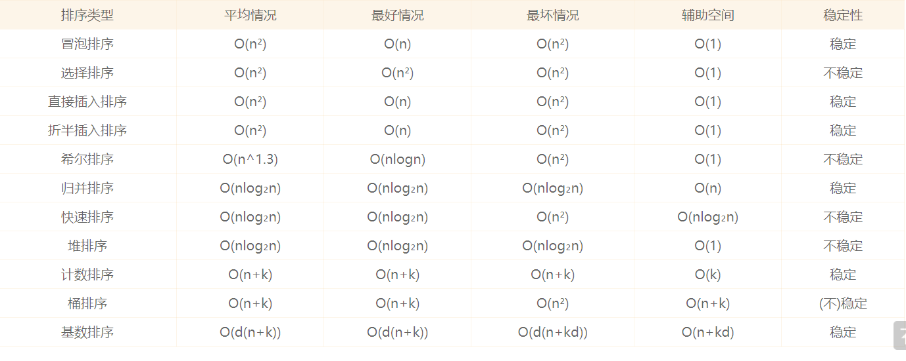
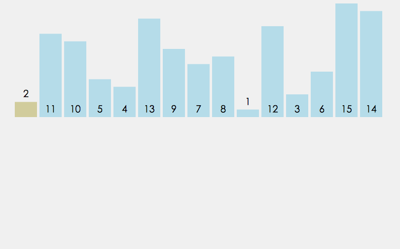
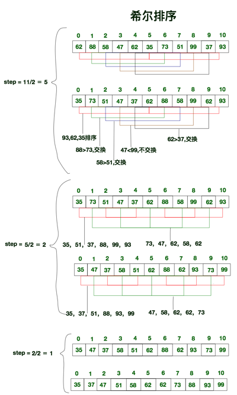

# 参考
[JS中可能用得到的全部的排序算法](http://louiszhai.github.io/2016/12/23/sort/#%E5%B0%8F%E7%BB%93)

# 目录
- 冒泡排序
- 双向冒泡排序
- 选择排序
- 插入排序
    - 直接插入排序
    - 折半插入排序
- 希尔排序
- 归并排序
- 快速排序
- 堆排序
- 计数排序
- 桶排序
- 基数排序

# 总结
- 虽然它们的值相同, 但它们相对的顺序却发生了变化. 我们将这种现象称作 不稳定性
- Chrome的v8引擎为了高效排序, 在排序数据超过了10条时, 便会采用快速排序. 对于10条及以下的数据采用的便是插入排序.

# 冒泡排序(不断交换位)

## 内外正序冒泡
**原理**:与相邻值比较并交换位置
0. 循环开始:
1. 指针从头往后移, 将当前的指针上元素和后一个元素对比, 如果大于它则和它将位置.
2. 指针到达结束点, 结束点的元素比前面的元素都大, 所以可以重置结束点位前一位.
3. 如果这次循环一次换位都没发生, 或者, 结束点为[1], 则循环结束;

## 双向冒泡
**原理**:简单冒泡是确定终点, 双向两次循环确定始终点
- 内部改为2次循环, 一次是逆取最小值, 一次正取最大值;
- 根据内部循环重新确立外循环的始终点;
- 如果内部其中有哪次循环没发生换位, 可以立即结束;

# 插入排序
## 直接插入排序

**原理**: 不断与前面的值比较以插入适当的位置
0. 循环开始;
1. 取当前值, 与前面的所有值比较;
2. 确定位置之后, 插入该位置 / 该位置之后的元素后移一位;

## 折半排序
**原理**: 因为前面的值是有序的, 所以我们可以**递归地折半比较**确定插入位置
- 与直接插入不同的是, 比较方法的不一样;
- 获得当前值后, **递归地折半比较**, 及与中位数值比较.确定高低半区后, 在重复与新的中位数值比较;

*虽然折半插入排序明显减少了查询的次数, 但是数组元素移动的次数却没有改变. 它们的时间复杂度都是O(n²).*

## 希尔排序
希尔排序也称缩小增量排序, 它是直接插入排序的另外一个升级版, 实质就是分组插入排序.

1. 将数组拆分为若干个子分组, 每个分组由相距一定”增量”的元素组成. 比方说将[0,1,2,3,4,5,6,7,8,9,10]的数组拆分为”增量”为5的分组, 那么子分组分别为 [0,5], [1,6], [2,7], [3,8], [4,9] 和 [5,10].
2. 然后对每个子分组应用直接插入排序.
3. 逐步减小”增量”, 重复步骤1,2.
4. 直至”增量”为1, 这是最后一个排序, 此时的排序, 也就是对全数组进行直接插入排序.

希尔排序实际上就是**不断的进行直接插入排序**, **分组是为了先将局部元素有序化**. 因为直接插入排序在元素基本有序的状态下, 效率非常高. 而希尔排序呢, 通过先分组后排序的方式, 制造了直接插入排序高效运行的场景. 因此希尔排序效率更高.