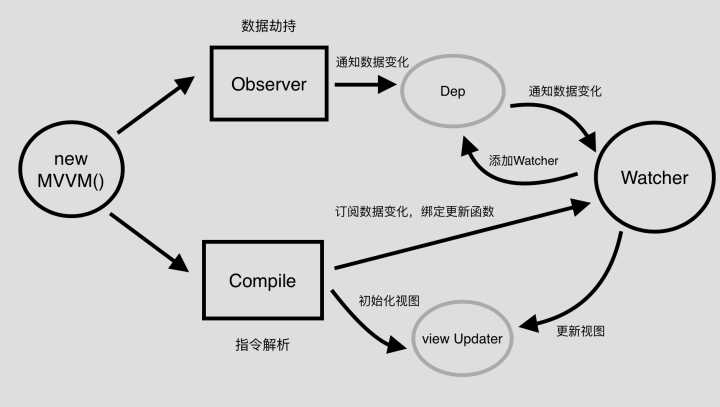

# ref
- [实现一个属于我们自己的简易MVVM库](https://zhuanlan.zhihu.com/p/27028242)

# 方案
## 数据绑定的实现方式:
1、数据劫持(vue)：通过Object.defineProperty() 去劫持数据每个属性对应的getter和setter
2、脏值检测(angular)：通过特定事件比如input，change，xhr请求等进行脏值检测。
3、发布-订阅模式(backbone)：通过发布消息，订阅消息进行数据和视图的绑定监听。

