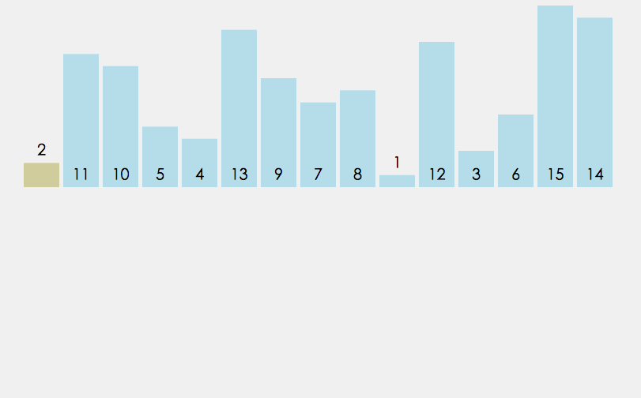
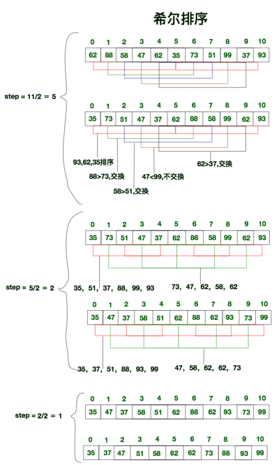

# 参考
[JS中可能用得到的全部的排序算法](http://louiszhai.github.io/2016/12/23/sort/#%E5%B0%8F%E7%BB%93)

# 目录
- 冒泡排序
- 双向冒泡排序
- 选择排序
- 插入排序
    - 直接插入排序
    - 折半插入排序
- 希尔排序
- 归并排序
- 快速排序
- 堆排序
- 计数排序
- 桶排序
- 基数排序

# 总结
- 虽然它们的值相同, 但它们相对的顺序却发生了变化. 我们将这种现象称作 不稳定性
- Chrome的v8引擎为了高效排序, 在排序数据超过了10条时, 便会采用快速排序. 对于10条及以下的数据采用的便是插入排序.


# 冒泡排序(不断交换位)


## 内外正序冒泡
**原理**:与相邻值比较并交换位置
0. 循环开始:
1. 指针从头往后移, 将当前的指针上元素和后一个元素对比, 如果大于它则和它将位置.
2. 指针到达结束点, 结束点的元素比前面的元素都大, 所以可以重置结束点位前一位.
3. 如果这次循环一次换位都没发生, 或者, 结束点为[1], 则循环结束;

```js
var arr = [10,1,11,7,22,55,5000,4,7,0,9,8,6];

function swap(i, j, array) {
  var temp = array[j];
  array[j] = array[i];
  array[i] = temp;
}

/* ---------------冒泡排序: 内外正------------------- */
var bubbleSort = function (arr) {

  var len = arr.length;
  for (var i = 1; i < len; i++) {

    var isSwap = false;

    for (var j = 0; j < len - i; j++) {
      if (arr[j] > arr[j + 1]) {
        swap(j, j + 1, arr)
        isSwap = true
      }
    }
    if (!isSwap) {
      break;
    }
  }
  return arr
}

console.log('冒泡排序(1):')
console.log(bubbleSort(arr))
```


## 双向冒泡
**原理**:简单冒泡是确定终点, 双向两次循环确定始终点
- 内部改为2次循环, 一次是逆取最小值, 一次正取最大值;
- 根据内部循环重新确立外循环的始终点;
- 如果内部其中有哪次循环没发生换位, 可以立即结束;

```js
/* ---------------双向冒泡排序------------------- */
var bothwayBubbleSort = function (arr){
  var st = 0, ed = arr.length - 1, isSwap = false;
  while(st < ed + 1) {
    //ed->st, 取最小值
    var i = ed;
    while (i > st) {
      if(arr[i] < arr[i-1]) {
        swap(arr[i], arr[i-1]);
        isSwap = true;
      }
      i--;
    }
    if(!isSwap){
      break;
    }
    st++;
    //st->ed, 取最大值
    for(var j = st; j < ed; j++){
      if(arr[i] > arr[i+1]) {
        swap(arr[i], arr[i+1]);
        isSwap = true;
      }
    }
    if(!isSwap){
      break;
    }
    ed--;
  }
  return arr;
}

console.log('\n')
console.log('双向冒泡排序:')
console.log(bothwayBubbleSort(arr))

```

# 插入排序
## 直接插入排序

**原理**: 不断与前面的值比较以插入适当的位置
0. 循环开始;
1. 取当前值, 与前面的所有值比较;
2. 确定位置之后, 插入该位置 / 该位置之后的元素后移一位;


```js
/* ---------------直接插入法排序------------------- */
var directInsertionSort = function(array) {
  var length = array.length, index, current;
  var _r = 0;
  for (var i = 1; i < length; i++) {
    index = i - 1;         //待比较元素的下标
    current = array[i];     //当前元素
    while(index >= 0 && array[index] > current) { //前置条件之一:待比较元素比当前元素大
      array[index+1] = array[index];    //将待比较元素后移一位
      index--;  //游标前移一位
    }
    if(index+1 != i){                   //避免同一个元素赋值给自身
      array[index+1] = current;            //将当前元素插入预留空位
    }
  }
  return array;
}

console.log('\n')
console.log('直接插入法排序:')
console.log(directInsertionSort(arr)) //91

```


## 折半排序
**原理**: 因为前面的值是有序的, 所以我们可以**递归地折半比较**确定插入位置
- 与直接插入不同的是, 比较方法的不一样;
- 获得当前值后, **递归地折半比较**, 及与中位数值比较.确定高低半区后, 在重复与新的中位数值比较;

*虽然折半插入排序明显减少了查询的次数, 但是数组元素移动的次数却没有改变. 它们的时间复杂度都是O(n²).*

```js
/* ---------------折半插入排序------------------ */

var binaryInsertionSort = function (array){
  var current, i, j, low, high, m;
  for(i = 1; i < array.length; i++){
    low = 0;
    high = i - 1;
    current = array[i];

    while(low <= high){            //步骤1&2: 递归的折半查找
      m = (low + high)>>1;
      if(array[i] >= array[m]){//值相同时, 切换到高半区，保证稳定性
        low = m + 1;        //插入点在高半区
      }else{
        high = m - 1;        //插入点在低半区
      }
    }
    for(j = i; j > low; j--){     //步骤3:插入位置之后的元素全部后移一位
      array[j] = array[j-1];
    }
    array[low] = current;         //步骤4:插入该元素
  }
  return array;
} 

console.log('\n')
console.log('折半插入排序:')
console.log(binaryInsertionSort(arr))

```


## 希尔排序
希尔排序也称缩小增量排序, 它是直接插入排序的另外一个升级版, 实质就是分组插入排序.



1. 将数组拆分为若干个子分组, 每个分组由相距一定”增量”的元素组成. 比方说将[0,1,2,3,4,5,6,7,8,9,10]的数组拆分为”增量”为5的分组, 那么子分组分别为 [0,5], [1,6], [2,7], [3,8], [4,9] 和 [5,10].
2. 然后对每个子分组应用直接插入排序.
3. 逐步减小”增量”, 重复步骤1,2.
4. 直至”增量”为1, 这是最后一个排序, 此时的排序, 也就是对全数组进行直接插入排序.

希尔排序实际上就是**不断的进行直接插入排序**, **分组是为了先将局部元素有序化**. 因为直接插入排序在元素基本有序的状态下, 效率非常高. 而希尔排序呢, 通过先分组后排序的方式, 制造了直接插入排序高效运行的场景. 因此希尔排序效率更高.

```js
/* ---------------希尔排序------------------ */
//直接插入排序就可以看做是步长为1的希尔排序
//形参增加步数gap(实际上就相当于gap替换了原来的数字1)
function directInsertionSort(array, gap) {
  gap = (gap == undefined) ? 1 : gap;       //默认从下标为1的元素开始遍历
  var length = array.length, index, current;
  for (var i = gap; i < length; i++) {
    index = i - gap;    //待比较元素的下标
    current = array[i];    //当前元素
    while(index >= 0 && array[index] > current) { //前置条件之一:待比较元素比当前元素大
      array[index + gap] = array[index];    //将待比较元素后移gap位
      index -= gap;                           //游标前移gap位
    }
    if(index + gap != i){                   //避免同一个元素赋值给自身
      array[index + gap] = current;            //将当前元素插入预留空位
    }
  }
  return array;
}

function shellSort(array){
  var length = array.length, gap = length>>1, current, i, j;
  while(gap > 0){
    directInsertionSort(array, gap); //按指定步长进行直接插入排序
    gap = gap>>1;
  }
  return array;
}
```